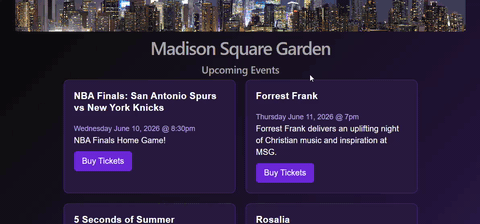

# WEB102 Project#1 - Community Board (Madison Square Garden Events Schedule)

Submitted by: Ariel Sosa

This website will display the next 10 unique events at Madison Square Garden in New York City

Time spent: 3 hours spent in total

## Required Features

The app has a cohesive, unique theme for events or resources relevant to a specific community

    -Header/title describing the theme is displayed

At least 10 unique events or resources are displayed in a responsive card format

    -There are at least 10 cards displayed for 10 different events

    -The cards are displayed in an organized format (for example in a grid, or in one line)

    -Each card should include some information about the event or resource

## Video Walkthrough

Here's a walkthrough of implemented features:

<!-- Replace this with whatever GIF tool you used! -->
GIF created with ScreenToGif.com
<!-- Recommended tools:
[Kap](https://getkap.co/) for macOS
[ScreenToGif](https://www.screentogif.com/) for Windows
[peek](https://github.com/phw/peek) for Linux. -->

## Notes

Describe any challenges encountered while building the app.

A Challenge I encountered while building this app was getting used to the enviroment of using vite and React.

## License

    Copyright 2026 Ariel Sosa

    Licensed under the Apache License, Version 2.0 (the "License");
    you may not use this file except in compliance with the License.
    You may obtain a copy of the License at

        http://www.apache.org/licenses/LICENSE-2.0

    Unless required by applicable law or agreed to in writing, software
    distributed under the License is distributed on an "AS IS" BASIS,
    WITHOUT WARRANTIES OR CONDITIONS OF ANY KIND, either express or implied.
    See the License for the specific language governing permissions and
    limitations under the License.
